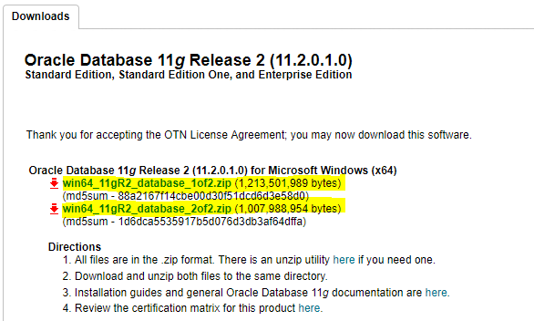
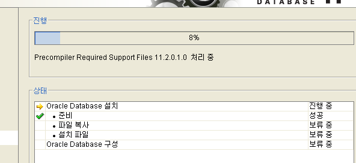

# CRUD
*OS : window10*

## Oracle DataBase
#### install Oracle DB
 > 1. Signin Oracle
 
 > 2. Go to Link [ [OracleDB 11g Release download...](https://www.oracle.com/technetwork/database/enterprise-edition/downloads/112010-win64soft-094461.html) ]

 
 > 3. unzip in same `Folder` (folder name :  database)
 
 > 4. **관리자 권한으로 실행**
 
 > 5. [팝업] `[INS-13001]환경이 최소 요구 사항을 충족하지 않습니다 계속하겠습니까?` ▶ **예(Y)**
 
 > 6. [보안 갱신 구성] ▶ 입력 X ▶ **다음(N)** ▶ [팝업] ▶ **예(Y)**
 
 > 7. [설치 옵션] 데이터베이스 생성 및 구성(C) ▶ **다음(N)**
 
 > 8. [시스템 클래스] 서버 클래스(S) ▶ **다음(N)**
 
 > 9. [Grid 설치 옵션] 단일 인스턴스 데이터베이스 설치(S) ▶ **다음(N)** 
 
 > 10. [설치 유형] 표준 설치(I) ▶ **다음(N)**
 
 > 11. [기본 설치] 
  
  |전역 데이터베이스 이름(G)|관리 비밀번호(P)|비밀번호 확인(C)|
 |:---:|:---:|:---:|
 | orcl | !@#!% | !@#!% |
 
 ▶ [팝업] `[INS-13001]환경이 최소 요구 사항을 충족하지 않습니다 계속하겠습니까?` ▶ **예(Y)**

 > 12. [필요 조건 검사] skip...
 
 > 13. [요약] ▶ **완료(F)**

 >  14. [제품 설치] ▶ 

  

 [팝업] Database Configuration Assistant

 >  15. `scott`, `sh` 계정 설정
 
 >  16. [완료]

```command
Microsoft Windows [Version 10.0.18362.267]
(c) 2019 Microsoft Corporation. All rights reserved.

C:\Users\ ... >SQLPLUS

SQL*Plus: Release 11.2.0.1.0 Production on 월 8월 5 13:56:29 2019

Copyright (c) 1982, 2010, Oracle.  All rights reserved.

사용자명 입력: system
비밀번호 입력: !@#$!@#!

다음에 접속됨:
Oracle Database 11g Enterprise Edition Release 11.2.0.1.0 - 64bit Production
With the Partitioning, OLAP, Data Mining and Real Application Testing options

SQL>
```